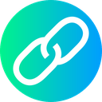
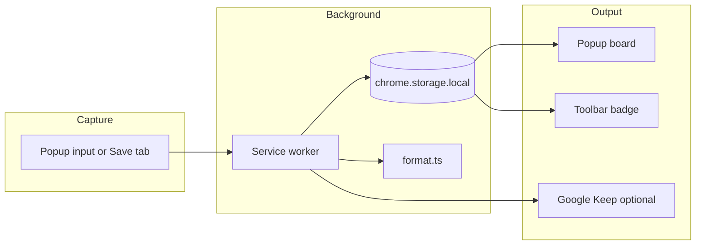

# KeepTab

<p align="center">
  
</p>

<p align="center">
  <strong>Open-source Chrome extension to save tabs, links, and notes while you browse.<br>
  Local-first personal board with optional Google Keep checklist sync.</strong>
</p>

<p align="center">
  <a href="manifest.json"></a>
  <a href="manifest.json"></a>
  <a href="LICENSE"></a>
  <a href="package.json"></a>
  <a href="package.json"></a>
  <a href="package.json"></a>
</p>

<p align="center">
  <a href="#quick-start">Quick start</a> ·
  <a href="#features">Features</a> ·
  <a href="#use-cases">Use cases</a> ·
  <a href="#usage-guide">Usage</a> ·
  <a href="#google-keep-sync">Keep sync</a> ·
  <a href="#development">Development</a> ·
  <a href="#faq">FAQ</a>
</p>

---

## What is KeepTab?

**KeepTab** is a free, open-source **Chrome extension** (Manifest V3) that helps you capture **browser tabs**, **bookmarked links**, and **quick notes** without leaving the page you are on.

Use it as a lightweight **tab saver**, **link bookmark manager**, or **read-it-later board** that lives entirely in your browser. Data stays on your device in `chrome.storage.local`. If you want a backup or second copy, turn on optional **Google Keep sync** to append each save as a checklist line in your own Keep note.

No sign-up. No API keys. No analytics. No third-party server.

---

## At a glance

| | |
|---|---|
| **What it does** | Captures page titles, URLs, pasted links, and free-text notes into a compact personal board |
| **Where data lives** | Locally in Chrome storage on your device. Optional sync to your own Google Keep checklist note |
| **Who it is for** | Researchers, developers, shoppers, and anyone collecting tabs, links, or quick notes without copy-paste |
| **Setup time** | About 2 minutes to load the extension. About 5 minutes to link a Keep note if you want sync |
| **Cost** | Free and open source. No accounts, no API keys, no cloud backend |

---

## Table of contents

- [What is KeepTab?](#what-is-keeptab)
- [Why KeepTab exists](#why-keeptab-exists)
- [Quick start](#quick-start)
- [How it works](#how-it-works)
- [Features](#features)
- [Use cases](#use-cases)
- [Item types](#item-types)
- [Output format](#output-format)
- [Install from source](#install-from-source)
- [Usage guide](#usage-guide)
- [Google Keep sync](#google-keep-sync)
- [Upgrading from v1](#upgrading-from-v1)
- [Privacy and data](#privacy-and-data)
- [Permissions explained](#permissions-explained)
- [Development](#development)
- [Project structure](#project-structure)
- [Architecture](#architecture)
- [Testing](#testing)
- [FAQ](#faq)
- [Troubleshooting](#troubleshooting)
- [Related projects](#related-projects)
- [Contributing](#contributing)
- [License](#license)
- [GitHub repo metadata](#github-repo-metadata)

---

## Why KeepTab exists

You find something worth keeping — a product page, a docs link, a reminder — and the usual workflow looks like this:

1. Copy the URL
2. Switch to Keep, Notion, or a notes app
3. Paste and format the line
4. Repeat for every tab

That adds friction dozens of times a day. KeepTab reduces it to **save, next**.

Stay on the page you are already on. Open the popup and click the tab icon to save, or paste a link or note. KeepTab stores a clean entry locally. If you enable Keep sync, each save can append a formatted line to your checklist note in the background.

No spreadsheet middleman. No manual formatting. No account required.

---

## Quick start

Already have the extension built? Skip to step 3.

```bash
git clone https://github.com/THEFZNKHAN/KeepTab.git
cd KeepTab
npm install
npm run icons
npm run build
```

1. Open `chrome://extensions`, enable **Developer mode**, click **Load unpacked**, and select the `KeepTab` folder.
2. Pin KeepTab to your Chrome toolbar.
3. Visit any website, open the KeepTab popup, and click the **tab icon** to save the current page.
4. Open the KeepTab popup to see your saved item.

Want automatic Keep sync? Jump to [Google Keep sync](#google-keep-sync).

---

## How it works



1. **Capture** — Save from the popup: paste a link or note, or capture the current tab with the tab icon.
2. **Store** — The background service worker deduplicates and persists items in `chrome.storage.local`.
3. **Use** — View, copy, or delete items in the popup. Optionally append each save to Google Keep.

---

## Features

### Capture

- **Save from popup** — Paste a URL or type a note in the input field and click **Save**
- **Save current tab** — Tab icon button in the popup captures the active tab's title and URL
- **Smart input** — Valid URLs save as links; plain text saves as notes
- **Duplicate detection** — Same URL or note text is not saved twice

### Board management

- **Compact popup UI** — 360×480px board with Inter typography and Material Symbols icons
- **Scrollable list** — All saved items in one view, newest first
- **Hover details** — Themed overlay card shows full title and URL without shifting the layout
- **Multi-select** — Checkbox per row for bulk actions
- **Copy all / Copy selected** — Export formatted lines to clipboard
- **Delete selected** — Remove checked items
- **Clear all** — Wipe the board with a confirmation dialog
- **Toolbar badge** — Green count badge on the extension icon

### Google Keep (optional)

- **Auto-append** — Each save adds a formatted line to your Keep checklist note
- **Test sync** — Verify your Keep note URL before relying on it
- **Graceful fallback** — On failure, copies the line to clipboard and opens your Keep note

### Technical

- **Manifest V3** — Modern Chrome extension architecture
- **TypeScript + esbuild** — Typed source with fast bundled output
- **Unit tests** — Format, storage, migration, and Keep settings coverage
- **v1 migration** — Automatically imports legacy `myLeads` data on first popup open

---

## Use cases

KeepTab works well when you need a fast, private capture tool instead of a full notes app:

| Scenario | How KeepTab helps |
|----------|-------------------|
| **Research tabs** | Save docs, articles, and reference pages with the popup tab icon |
| **Shopping comparisons** | Collect product URLs and short notes before deciding what to buy |
| **Developer bookmarks** | Stash GitHub repos, Stack Overflow threads, and API docs in a clean export format |
| **Meeting follow-ups** | Jot quick action items in the popup and copy them into Slack or email |
| **Read-it-later queue** | Build a lightweight link backlog locally, then copy all lines into Keep or another tool |
| **Google Keep users** | Auto-append saves to a Keep checklist note so your board and Keep stay in sync |

---

## Item types

KeepTab stores three internal item types. They are not shown as badges in the UI, but they affect how items are captured and deduplicated.

| Type | How it is saved | Stored fields |
|------|-----------------|---------------|
| **Tab** | Save current tab from the popup | Page title, full URL, optional favicon |
| **Link** | Paste a URL in the popup input | Derived title (host + path), full URL |
| **Note** | Paste or type non-URL text in the popup input | Note body, short display title |

**Dedupe rules:**

- **Tab / Link** — Normalized URL (lowercase host, no trailing slash, no hash)
- **Note** — Trimmed, case-insensitive body text

---

## Output format

KeepTab uses one canonical line format for clipboard export and Google Keep sync.

**Tabs and links:**

```
Page Title | https://example.com/path
github.com/user/repo | https://github.com/user/repo
```

**Notes:**

```
Remember to follow up with the client
```

Rules:

- Tabs and links: `{title} | {full URL}`
- Notes: plain text only
- No type prefixes (`[Tab]`, `[Link]`, `[Note]`)
- No dates in the exported line

---

## Install from source

### Requirements

- [Google Chrome](https://www.google.com/chrome/) 120 or newer
- [Node.js](https://nodejs.org/) 18 or newer
- Python 3 with [Pillow](https://pypi.org/project/pillow/) (for icon generation only)

### Build steps

```bash
# Clone the repository
git clone https://github.com/THEFZNKHAN/KeepTab.git
cd KeepTab

# Install dependencies
npm install

# Generate circular icons (16, 32, 48, 128) from icons/icon.png
npm run icons

# Build extension bundles into dist/
npm run build
```

### Load in Chrome

1. Open `chrome://extensions`
2. Enable **Developer mode** (top-right toggle)
3. Click **Load unpacked**
4. Select the **`KeepTab` folder** (the repo root, not `dist/` alone)
5. Pin KeepTab from the extensions menu

### After code changes

```bash
npm run build
```

Then click the **Reload** button on the KeepTab card at `chrome://extensions`.

For continuous rebuilds during development:

```bash
npm run watch
```

---

## Usage guide

### Save a link

1. Open the KeepTab popup
2. Paste a URL into the input field (e.g. `https://github.com/user/repo`)
3. Click **Save**

The item appears in your board with the page host/path as the subtitle.

### Save a note

1. Open the popup
2. Type any non-URL text (e.g. `Call dentist tomorrow`)
3. Click **Save**

### Save the current tab

**From the popup:**

1. Navigate to the page you want to save
2. Open the KeepTab popup
3. Click the **tab icon** next to the input field

### Copy items

- **Copy all** — Copies every item on the board as formatted lines
- **Copy selected** — Check one or more rows, then click **Copy selected**

Paste the result into Keep, Slack, email, or any text field.

### Delete items

- **Delete selected** — Check rows, then click the trash icon
- **Clear all** — Click the clear icon, then confirm in the dialog

Clearing KeepTab does **not** remove lines already appended to Google Keep.

### View full details

Hover over any list row. A themed overlay card shows the full title and URL (or full note text) without moving other items.

---

## Google Keep sync

KeepTab can automatically append each saved item to a **Google Keep checklist note** you own.

### Setup (one time)

1. In [Google Keep](https://keep.google.com), create or open a **checklist** note
2. Copy the full URL from your browser address bar. It should contain `#LIST/` followed by a long ID:
   ```
   https://keep.google.com/#LIST/1vOq_nsNuaC7HtFeKuzCI_AaGu-MD4YIAN4XpCY-lLkgRZUVq-Jug6cb07iUMKg
   ```
3. Open KeepTab popup → **Settings** (gear icon)
4. Enable **Auto-add saves to Google Keep**
5. Paste your note URL into **Board note URL**
6. Click **Test Keep sync** — a test line should appear in your Keep note
7. Click **Save settings**

### What gets appended

Each save adds one checklist item using the [output format](#output-format):

```
ALL-IN-ONE PACKAGE TRACKING | 17TRACK | https://t.17track.net/en
Remember to follow up
```

### If sync fails

KeepTab will:

1. Copy the formatted line to your clipboard
2. Open your Keep note in a new tab so you can paste manually
3. Show an error toast in the popup

Common causes: incomplete Keep URL, Keep note not open recently, or Chrome blocking the background tab.

### Keep sync is optional

KeepTab works fully offline and locally without Keep. Sync is opt-in only.

---

## Upgrading from v1

KeepTab v1 was a simple popup scratchpad that saved strings to `localStorage` under the key `myLeads`.

**v2 migrates automatically:**

1. Build and load v2 as described above
2. Open the KeepTab popup once
3. Legacy strings import into the new board:
   - Strings that look like URLs → **link** items
   - Everything else → **note** items
4. The old `myLeads` key is removed after migration

You should see a toast: `Imported N items from KeepTab v1.`

---

## Privacy and data

| Data | Location | Shared? |
|------|----------|---------|
| Saved items (titles, URLs, notes) | `chrome.storage.local` on your device | Never |
| Keep settings (note URL, enabled flag) | `chrome.storage.local` on your device | Never |
| Google Keep lines | Your Keep account (if sync enabled) | Only to your own note |

KeepTab has:

- No analytics
- No remote server
- No user accounts
- No telemetry

All processing happens in your browser. Keep sync writes directly to your Google Keep note via an automated tab — KeepTab never sends data to a third-party backend.

---

## Permissions explained

| Permission | Why KeepTab needs it |
|------------|------------------------|
| `storage` | Save board items and Keep settings locally |
| `tabs` | Read the active tab's title and URL when you save a tab |
| `scripting` | Run the Keep list-append helper on `keep.google.com` |
| `debugger` | Insert trusted keyboard input so Google Keep persists checklist items |
| `https://keep.google.com/*` | Open and update your Keep checklist note during sync |

KeepTab does **not** inject UI into web pages. It only captures the page title and URL when you explicitly save from the popup.

---

## Development

### npm scripts

| Command | Description |
|---------|-------------|
| `npm run build` | Bundle TypeScript to `dist/` and copy popup HTML/CSS |
| `npm run watch` | Rebuild automatically on file changes |
| `npm test` | Run all unit tests |
| `npm run icons` | Generate 16/32/48/128 PNG icons from `icons/icon.png` |

### Tech stack

| Layer | Choice |
|-------|--------|
| Platform | Chrome Extension Manifest V3 |
| Language | TypeScript 5.7 (strict mode) |
| Build | esbuild → IIFE bundles |
| Storage | `chrome.storage.local` |
| UI | Vanilla HTML/CSS/TypeScript (no framework) |
| Icons | Inter + Material Symbols Outlined |
| Tests | Node built-in test runner |

### Build output

The manifest points to `dist/`:

```
dist/
  background.js   ← Service worker
  popup.html      ← Popup shell
  popup.css       ← Popup styles
  popup.js        ← Popup logic
```

Source lives in `src/`. Edit source files, run `npm run build`, then reload the extension.

---

## Project structure

```
KeepTab/
├── manifest.json              # MV3 extension manifest
├── package.json
├── tsconfig.json
├── icons/
│   ├── icon.png               # Master icon (source for generation)
│   ├── icon16.png
│   ├── icon32.png
│   ├── icon48.png
│   └── icon128.png
├── scripts/
│   ├── build.mjs              # esbuild bundler
│   ├── build-test.mjs         # Compile shared modules for tests
│   └── generate-icons.mjs     # Pillow icon generator
├── src/
│   ├── background/
│   │   └── main.ts            # Message router, badge init, Keep hook
│   ├── popup/
│   │   ├── popup.html         # Board + settings + confirm dialog
│   │   ├── popup.css          # Design tokens and layout
│   │   └── popup.ts           # List rendering, actions, settings
│   └── shared/
│       ├── types.ts           # BoardItem, message types
│       ├── storage.ts         # CRUD, dedupe, badge
│       ├── format.ts          # Input parsing, export lines
│       ├── messaging.ts       # MV3 service worker wake retry
│       ├── tab-capture.ts     # Active tab / page metadata
│       ├── migrate.ts         # v1 myLeads import
│       ├── keep-settings.ts   # Keep note URL parsing
│       ├── keep-sync.ts       # Keep append orchestration
│       ├── keep-append-page.ts# Injected Keep DOM script
│       └── keep-debugger.ts   # Trusted text input via debugger API
├── tests/
│   ├── format.test.mjs
│   ├── storage.test.mjs
│   ├── migrate.test.mjs
│   └── keep-settings.test.mjs
└── dist/                      # Built output (load via manifest)
```

---

## Architecture

### Message flow

The popup communicates with the background service worker through a typed message bus:

| Action | Description |
|--------|-------------|
| `save` | Save a board item (with dedupe + optional Keep sync) |
| `saveTab` | Capture and save the active browser tab |
| `getAll` | Return all board items |
| `delete` | Remove items by ID |
| `clear` | Remove all items |
| `getKeepSettings` / `setKeepSettings` | Read/write Keep configuration |
| `testKeepAppend` | Append a test line to Keep |
| `getLastKeepResult` | Last Keep sync status for popup toast |

The messaging layer retries up to three times to handle MV3 service worker wake delays.

### Keep append pipeline

When Keep sync is enabled, each save triggers:

1. Open or reuse a Keep tab with your checklist note
2. **Prepare** — Inject a script to focus the list field and check for duplicates
3. **Insert** — Use the Chrome debugger API for trusted text input
4. **Commit** — Click "Add list item" in Keep's UI
5. **Verify** — Confirm the line persisted

If any step fails, the formatted line is copied to clipboard and the Keep note opens for manual paste.

---

## Testing

```bash
npm test
```

This compiles shared modules to `dist-test/` and runs:

| Test file | Covers |
|-----------|--------|
| `format.test.mjs` | URL detection, title derivation, export line formatting |
| `storage.test.mjs` | Save, dedupe, delete, badge updates |
| `migrate.test.mjs` | Legacy `myLeads` string import |
| `keep-settings.test.mjs` | Keep URL parsing and settings normalization |

All tests use Node's built-in test runner with mocked `chrome.storage`.

---

## FAQ

**Does KeepTab work on `chrome://` pages?**

No. Chrome blocks extensions from reading tabs on browser internal pages (`chrome://`, etc.). Navigate to a regular website first, then use **Save current tab** from the popup.

**Why does KeepTab need the `debugger` permission?**

Google Keep only persists checklist items from trusted keyboard input. KeepTab uses the debugger API briefly to simulate that input, then detaches immediately.

**Can I use a regular Keep note instead of a checklist?**

Keep sync is designed for **checklist** notes (`#LIST/...` URLs). Regular text notes (`#NOTE/...`) may not work reliably.

**Will duplicates sync to Keep twice?**

No. The Keep append script checks existing list items before inserting. Duplicate saves are detected both locally and in Keep.

**Does clearing KeepTab delete my Keep note?**

No. **Clear all** only removes items from KeepTab's local storage. Lines already in Keep stay untouched.

**Can I sync to multiple Keep notes?**

Not currently. v2 supports one board note URL. Use **Copy all** to move items elsewhere manually.

**Is KeepTab related to KeepShelf?**

KeepTab and [KeepShelf](../TrackBuddy) share the same architecture (TypeScript, MV3, Keep sync pipeline) but serve different purposes. KeepShelf tracks movies, series, anime, and books from specific sites. KeepTab is a general-purpose link and note board.

---

## Troubleshooting

### Extension won't load

- Run `npm run build` and confirm `dist/` contains `background.js`, `popup.js`, `popup.html`, and `popup.css`
- Run `npm run icons` if icon files are missing from `icons/`
- Load the **repo root folder**, not `dist/` alone

### "KeepTab background is not running"

Reload the extension at `chrome://extensions`. MV3 service workers sleep when idle; the messaging layer retries automatically, but a full reload fixes persistent failures.

### Save tab fails on certain pages

Restricted URLs (`chrome://`, `chrome-extension://`, `edge://`, `about:`) cannot be saved from the tab API. Navigate to a regular website first.

### Keep sync fails

1. Paste the **full** Keep URL from your browser (the long `#LIST/...` link)
2. Open the Keep note manually once before testing
3. Use **Test Keep sync** in Settings
4. Check that Keep sync is enabled and settings are saved
5. On failure, paste the copied line from your clipboard manually

### Imported v1 items missing

Migration runs once on first popup open after upgrading. If you already opened v2 before v1 data existed, or `myLeads` was empty, nothing imports. Legacy data must still be in popup `localStorage` under the key `myLeads`.

### Changes not appearing

After editing source files:

```bash
npm run build
```

Then reload KeepTab at `chrome://extensions`.

---

## Related projects

| Project | Purpose |
|---------|---------|
| **[KeepShelf](../TrackBuddy)** | Save movies, series, anime, and books from Google, IMDb, Goodreads, and more |

Both extensions share a similar MV3 architecture, popup design language, and Google Keep sync pipeline.

---

## Contributing

Issues and pull requests are welcome.

1. Fork the repository
2. Create a feature branch
3. Run `npm run build` and `npm test`
4. Open a pull request with a clear description of what changed and why

Please keep user-facing copy free of em-dashes. Use periods, commas, or colons instead.

---

## License

[MIT](LICENSE). Free to use, modify, and distribute.
